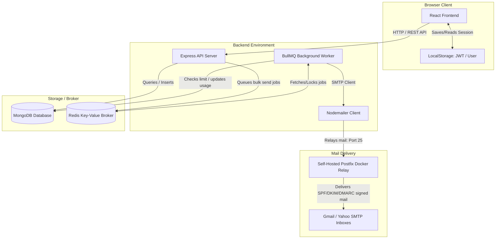

# System Integrations (`INTEGRATIONS.md`)

This document details all communication paths, network channels, and external API dependencies that tie the frontend, backend, database, queue, and mail relay together.

---

## 🗺️ High-Level Integration Map

---

## 🔌 Connection Details & Channels

### 1. Frontend ↔️ Backend (REST API)
- **Protocol:** HTTP / JSON
- **Client Integration:** Implemented via a lightweight fetch wrapper `apiFetch` in `E:\mailer\frontend\src\utils\api.js`.
- **Authentication:** Token-based. Upon login or registration, the backend returns a JWT token. The frontend stores it in `localStorage` under `mailerToken` and appends it to subsequent API requests as an `Authorization: Bearer <token>` header.
- **Auto-Logout Mechanism:** If any API request returns a `401 Unauthorized` response, the frontend clears the session from `localStorage` and automatically routes the user back to the login screen.

### 2. Backend ↔️ MongoDB (Database)
- **Protocol:** MongoDB Wire Protocol
- **Client Integration:** Managed by `mongoose` in `E:\mailer\backend\src\config\db.js`.
- **Authentication:** Connected via `process.env.MONGO_URI`.
- **Collections Used:**
  - `users`: User profiles, hashed passwords, and authorization roles.
  - `domains`: Active sending domains, limits, daily usages, and overall counters.
  - `campaigns`: Campaign drafts, recipients array with status (`pending`/`sent`/`failed`), sender rotation methods, and delay profiles.

### 3. Backend ↔️ Redis (BullMQ Queue)
- **Protocol:** TCP
- **Client Integration:** Initialized in `E:\mailer\backend\src\config\queue.js` and consumed by worker in `E:\mailer\backend\src\queues\worker.js`.
- **Authentication:** Connects to Redis host via `process.env.REDIS_HOST` (default `127.0.0.1`) and `process.env.REDIS_PORT` (default `6379`).
- **Queue Name:** `emailSendingQueue`
- **Job Options:**
  - `removeOnComplete`: Retains the last 1000 completed jobs.
  - `removeOnFail`: Retains the last 5000 failed jobs.
  - Retries: Attempts each failed email sending job up to `3` times with an **exponential backoff** delay of `5000ms`.

### 4. Background Worker ↔️ SMTP Mail Relay
- **Protocol:** SMTP (Port 25 or custom)
- **Client Integration:** Managed by `nodemailer` inside the BullMQ worker in `E:\mailer\backend\src\queues\worker.js`.
- **Configuration:**
  - Host: `process.env.MAIL_RELAY_HOST` (default `mail`).
  - Port: `process.env.MAIL_RELAY_PORT` (default `25`).
  - Secure: `false` (plain text or STARTTLS).
  - Ignore TLS: Controlled via `process.env.MAIL_RELAY_IGNORE_TLS` (ignores TLS certificate verification if set to `true`).
- **Cryptographic Trust:** Postfix signs emails using OpenDKIM keys. The parent domain contains SPF records verifying the VPS IP and MX/DMARC records ensuring authenticity.
